## Chapter One - Probability
#### Q1
If _μ_ is a probability measure then for any integer _n_ ≥ 2, and disjoint sets _A_<sub>1</sub>, ..., _A_<sub>n</sub>


---


#### Q2
Simulate 6000 dice rolls. Count the number of 1's, 2's, ..., 6's

```r
x <- sample(6, 6000, replace=T)
for (i in 1:6) {
  print(sum(x == i))
}

#[1] 1038
#[1] 1007
#[1] 963
#[1] 1021
#[1] 974
#[1] 997
```

About how often would you expect to get more than 1030 1's? Run an `R` simulation to estimate the answer.

```r
x <- rep(0, 1000)
for (i in 1:1000) {
  y <- sample(6, 6000, replace=T)
  x[i] <- sum(y == 1)
}

sum(x > 1030)
#[1] 153
```

#### Q3
In the board game _Risk_ players place their armies in different countries and try eventually to control the whole world by capturing countries one at a time from other players. To capture a country, a player must attack it from an adjacent country. If player A has _A_ ≥ 2 armies in country _A_, she may attack adjacent country _D_. Attacks are made with from 1 to 3 armies. Since at least 1 army must be left behind in the attacking country, A may choose to attack with a minimum of 1 and a maximum of min(3, _A_ − 1) armies. If player D has _D_ ≥ 1 armies in country _D_, he may defend himself against attack using a minimum of 1 and a maximum of min(2, _D_) armies. It is almost always best to attack and defend with the maximum permissible number of armies.
When player A attacks with _a_ armies she rolls _a_ dice. When player D defends with _d_ armies he rolls _d_ dice. A’s highest die is compared to D’s highest. If both players use at least two dice, then A’s second highest is also compared to D’s second highest. For each comparison, if A’s die is higher than D’s then A wins and D removes one army from the board; otherwise D wins and A removes one army from the board. When there are two comparisons, a total of two armies are removed from the board.

If A attacks with one army (she has two armies in country A, so may only attack
with one) and D defends with one army (he has only one army in country D)
what is the probability that A will win?

```r
x <- rep(0, 36)
for (i in 1:6) {
  for (j in 1:6) {
    if (i > j) {
      x[(i - 1) * 6 + j] <- 1
    } else {
      x[(i - 1) * 6 + j] <- 0
    }
  }
}

sum(x == 1) / length(x)

#[1] 0.4166667
```

Suppose that Player 1 has two armies each in countries C<sub>1</sub>, C<sub>2</sub>, C<sub>3</sub> and C<sub>4</sub>, that Player 2 has one army each in countries B<sub>1</sub>, B<sub>2</sub>, B<sub>3</sub> and B<sub>4</sub>, and that country C<sub>i</sub> attacks country B<sub>i</sub>. What is the chance that Player 1 will be successful in at least one of the four attacks?


#### Q4
Justify the last step of Equation 1.2.

For any fixed number _a_:


Justify the last step of the proof of Theorem 1.1.

Let _X_ be a random variable with pdf _p_<sub>X</sub>. Let _g_ be a differentiable, monotonic, invertible function and define _Z = g(X)_. Then the probability density function of _Z_ is:

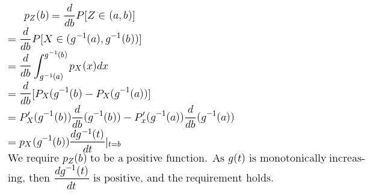

Prove Theorem 1.1 when _g_ is a decreasing function.

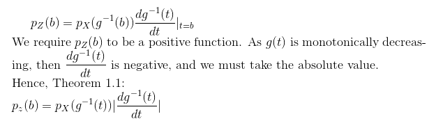

#### Q5
_Y_ is a random variable. _Y_ ∈ (-1, 1). The pdf is _p(y) = ky_<sup>2</sup> for some constant, _k_.

Find _k_.

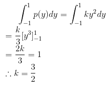

Use `R` to plot the pdf.

```r
eq = function (x) {3 * x * x / 2}
plot(eq, -1, 1)
```

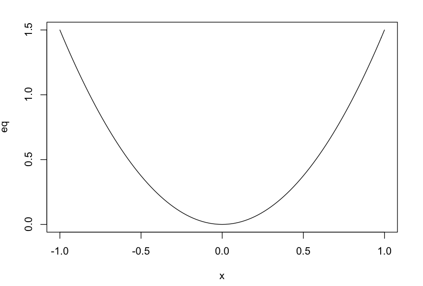

Let _Z = -Y_. Find the pdf of _Z_.

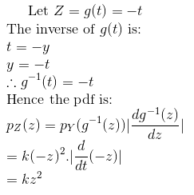

#### Q6
_U_ is a random variable on the interval [0, 1], _p_<sub>U</sub> = 1.

_V = U_^2. On what interval does _V_ live? Plot _V_ as a function of _U_. Find the pdf of _V_. Plot _p_<sub>V</sub>_(v)_ as a function of _v_.

_V_ ∈ [0, 1].

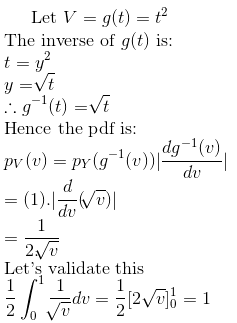

```r
v.u = function (u) {u * u}
p.v = function (v) {1 / (2 * sqrt(v))}
par(mfrow = c(2, 1))
plot(v.u, 0, 1)
plot(p.v, 0, 1)
```

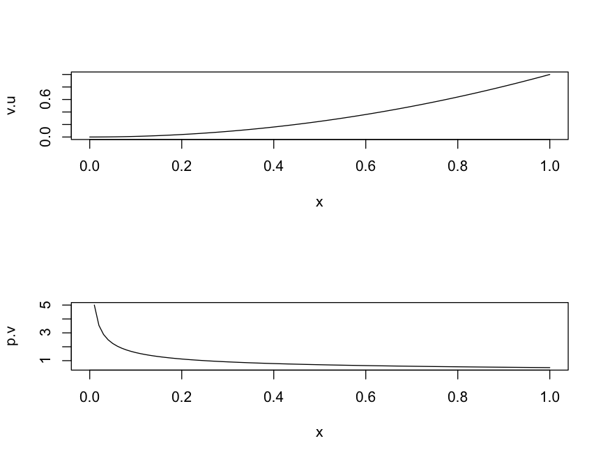

_W = 2U_. On what interval does _W_ live? Plot _W_ as a function of _U_. Find the pdf of _W_. Plot _p_<sub>W</sub>_(w)_ as a function of _w_.

_W_ ∈ [0, 2].

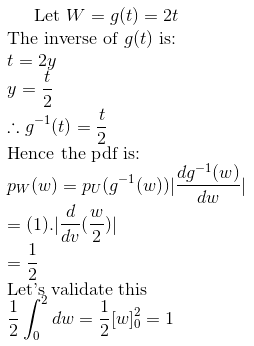

```r
w.u = function (u) {2*u}
par(mfrow = c(2, 1))
plot(w.u, 0, 2)
plot(c(0, 2), c(0.5, 0.5), xlab="u", ylab="p(w)", type="l")
```

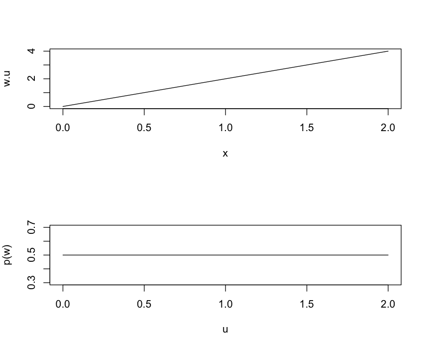

_X_ = -log(_U_). On what interval does _X_ live? Plot _X_ as a function of _U_. Find the pdf of _X_. Plot _p_<sub>X</sub>_(x)_ as a function of _x_.

_X_ ∈ [0, ∞)

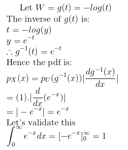

```r
x.u = function (u) {-log(u)}
p.x = function (x) {exp(-x)}
par(mfrow = c(2, 1))
plot(x.u, 0, 100)
plot(p.x, 0, 100)
```

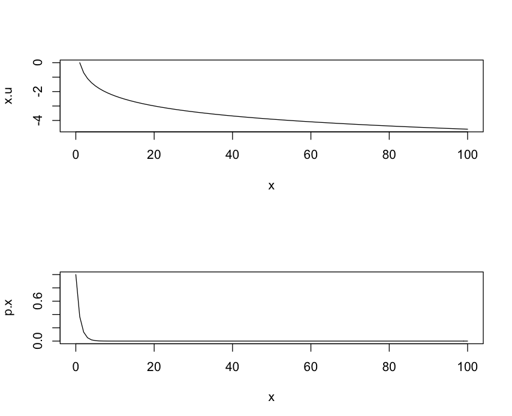
